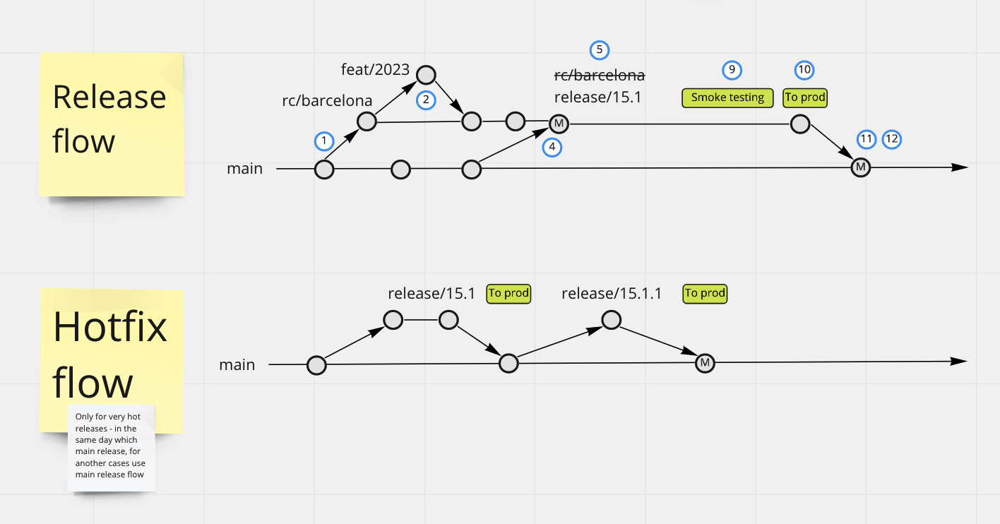

## Problems: 
- parallel releases 
- numbering of releases is not working
- lost changes from other team 
- common release have a lot of deps

## Agreements:
- One ticket - one commit (using squash for feat branches) 
- Main is common branch which equal to prod version
- Each release branch should start from main 
- Responsible for back merge should be in release notice
- Remove branches after merging
- **Each ticket should include release number**
- Using **squash** for _feat_ branches and **merge** for _release_ and _main_ branches

## Naming: 
### Branches: 
- task/2345 or feat/2345-short-name
- release/tr/15.5.5
### Commit: 
- must include ticket number
- format - 2345: Short description 

### Release flow: 
1. Create release candidate branch `rc/barcelona` from main branch 
(name of release candidate should be with release context, for example `rc/warranty`, if not possible - use football teams) 
2. Developing features (feat/2023) and merge to `rc/barcelona` 
3. Release is ready (all tickets are closed)
4. Merge `main` branch to `rc/barcelona` 
5. Get version from Scrum Master and rename `rc/barcelona` to `release/15.1`
6. Scrum Master renames `barcelona` to `15.1` in tickets
7. Deploy final version to environment for smoke testing (as usual - UAT env) 
9. Smoke testing 
10. Deploy to PROD
11. Merge release/15.1 to main
12. Freeze release/15.1

### Difference with previous version:
- added `rc/barcelona` branches 
- release version takes just before smoke testing
- use release version for change branch `rc/barcelona` to `release/15.1` 

