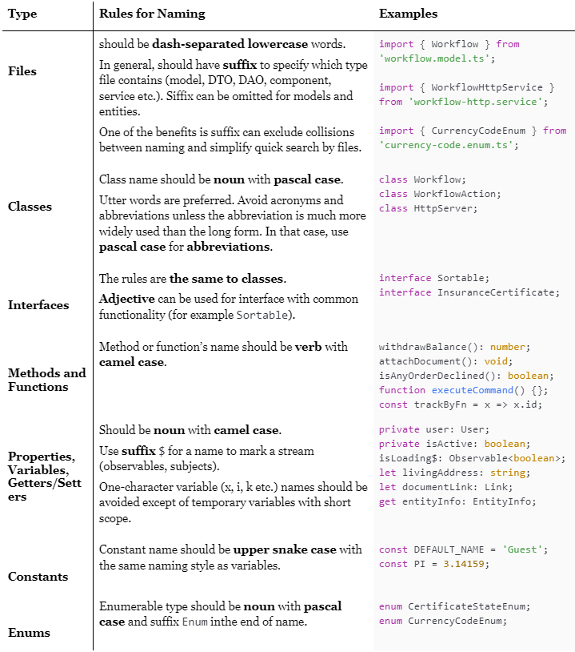

# Common 
### 1. Naming convention



### 2. Name should comply with single responsibility principle. Don’t use words such as and, or etc. It’s better to split such method to several methods.

| GOOD | BAD |
|--|--|
| `approveInspection() {};`<br/>`sumbitInspection() {};` | `approveInspectionAndSubmit() {};` |
| `isInspectionApproved: boolean;` <br/> `isInspectionDeclined: boolean` | `isInspectionApprovedOrDeclined: boolean;` |


### 3. Keep code flat, don't use redundant block nesting. Handle negative cases at the first. We read code from top to bottom, reducing nesting helps to prove readability:

BAD
```
  recalculateAllTimeSlots(timeSlots: TimeSlotsResponseModel): void {
    if (timeSlots) {
      this.allTimeSlots = [...timeSlots.bookedTimeSlots, ...timeSlots.freeTimeSlots].sort(
        (a, b) => a - b,
      );
    }
  }
```

GOOD
```
  recalculateAllTimeSlots(timeSlots: TimeSlotsResponseModel): void {
    if (!timeSlots) {
      return;
    }

    this.allTimeSlots = [
      ...timeSlots.bookedTimeSlots,
      ...timeSlots.freeTimeSlots
    ].sort((a, b) => a - b);
  }
```
### 4. Type can be omitted if property has default value:

GOOD
```
isFormValid: boolean = false;
event: EventEmitter<void> = new EventEmitter<void>();
```

BETTER
```
isFormValid = false;
event = new EventEmitter<void>();

```

### 5. Declare enum or constant for every magic numbers and literals.

### 6. Use camel case to proxy Enum from class to html of angular component
`myEnum = MyEnum`

### 7. Comments convention

Every TODO comment should have link to task which represents what needs to be improved or changed.
Preferable not to comment code. If something needs to be covered with comments it's possible can be improved. Use doc comments instead of simple `//`. For large description tsdoc can be used, https://tsdoc.org/.

Example:
BAD
```
// TODO: Delete in future
```

GOOD
```
/** TODO: Delete after bug has been completed #link-to-the-bug */
```


### 8. Import sorting
Use `eslint-plugin-simple-import-sort` to sort imports. Will help to prevent conflicts in pull requests.
Tip: Jetbrains' IDEs have good settings for import soring. (hotkey: ctrl + alt + L)


### 9. Operators alignment
For new code, both operator and right operand should be moved to the new line for long conditions.
It's commonly used convention, moreover it's easier to read while expressions are long.

Tip: Sometimes for long expressions, new variables can be created.

Example:

 BAD
```
if (
checkpoint?.checkpointValue &&
  checkpoint?.checkpointValue !== checkpoint?.checkpointCloneValue &&
  !(!!selectedCheckpoint && selectedCheckpoint?.checkpointId === checkpoint?.checkpointId)
)
```


GOOD
```
if (
  checkpoint?.checkpointValue
    && checkpoint?.checkpointValue !== checkpoint?.checkpointCloneValue
    && !(
      !!selectedCheckpoint
        && selectedCheckpoint?.checkpointId === checkpoint?.checkpointId
    )
)
```


BEST
```
const isCheckpointValueEqual = checkpoint?.checkpointValue
  && checkpoint?.checkpointValue !== checkpoint?.checkpointCloneValue;

const isCheckpointIdEqual = !!selectedCheckpoint
  && selectedCheckpoint?.checkpointId === checkpoint?.checkpointId;

if (isCheckpointValueEqual && !isCheckpointIdEqual)
```

### 10. Full name for callback arguments, especially for large callbacks

BAD
```
documents
 .filter(x => !!x)
 .forEach(x => makeSth(x));
```

GOOD
```
documents
 .filter(document => !!document)
 .forEach(document => makeSth(document));
```

# Classes and interfaces

### 1. All frontend models
Use classes to describe frontend models, it can help to attach static methods to this class etc.
Exception is backend models. All Backend models are automatically generated with interfaces.

BAD
```
export interface InspectionModel {
}
```

GOOD
```
export class InspectionModel {
}
```


### 2. Interface usage
Interfaces can be used as `adjectives` for some abstract models:

GOOD
```
export interface Sortable {
   sortField: string;
   asc: boolean;
}

export interface Filterable {
  filterField: string;
  filterValue: string | number;
}

...

export class InspectionModel implements Sortable, Filterable {
...
}
```

### 3. Class properties initialization
Properties of the class should be initialized in constructor. Linter shows errors for properties of components which are initialized in `ngOnInit` method or through `@Input`.
Use `!` operator to prevent such errors. (more you can read in TS doc: https://www.typescriptlang.org/docs/handbook/release-notes/typescript-2-7.html#strict-class-initialization)

BAD
```
class ButtonComponent() {
   @Input() label: string;
}

```
GOOD
```
class ButtonComponent() {
   @Input() label!: string;
}
```

### 4. Don't use `public` access modifier for public methods and properties

| GOOD | BAD |
|--|--|
| location: string;<br />latitude: number;<br /><br />ngOnInit() {<br />} | public location: string;<br />public latitude: number;<br /><br />public ngOnInit() {<br />} |


### 5. Use explicit return type for methods even if it returns void.
It helps to understand the intention of the developer who has written the method.
Example with `void` return type:
```
someMethod(): void {
}
```
### 6. Do not use _ as a prefix for private properties except of private properties with getters and setters.
Example of using `_` prefix:
```
private _prop: string;

get prop(): string {
 return this._prop;
}

set prop(value: string): void {
  this._prop = value;
}
```

### 7. Don't use `I` prefix for interfaces 
### 8. Use suitable suffixes for classes (`Model`, `Service`, `Component` etc.)
### 9. Angular Component's constructor shouldn't contain any logic. Use hooks instead

# Observables

### 1. Use suffix `$` if variable/getter keeps observable or calls `.asObservable`:

| GOOD | BAD |
|--|--|
| `inspection$: Observable<Inspection>` | `name: Array<string>` |
| `get state$() { return this.state.asObservable(); }` | `get state() { return this.state.asObservable(); }` |

### 2. Unsubscribe from every subscription. It prevents from possible memory leaks.
Every http request should be unsubscribed too to prevent possible memory leaks due to `*map` operators. 
Every services also should contain unsubscribe since services can be provided for component instead of module.
Unsubscribe also should be added after take(1). If component is being destroyed, pending request will be aborted if unsubscribe is used.

### 3. Use implementation bellow to unsubscribe:
```
import type { SubscriptionLike } from 'rxjs';
import { Subscription } from 'rxjs';

export class SubSink extends Subscription {
  set sink(subscription: SubscriptionLike) {
    this.add(subscription);
  }
}
```
Example of usage: 
```
subSink =  new SubSink();
...
subSink.sink = stream$.subscribe();
...
ngOnDestroy() {
 this.subSink.unsubscribe();
}
```

### 4. Using `async` pipe is preferable

# Boolean variables naming
### 1. Use link bellow to name boolean variables. It helps to keep code clear.
https://dev.to/michi/tips-on-naming-boolean-variables-cleaner-code-35ig

| BEST | AVERAGE | BAD |
|--|--|--|
| `isElementVisible: boolean;` | `isElementShown: boolean;` | `showElement: boolean;` |
| `isInspectionDeclined: boolean;` | `inspectionIsDeclined: boolean;` | `inspectionDeclined: boolean;` |
| `isEachDocumentLoaded: boolean;` | `documentsAreLoaded: boolean;` | `documetsLoad: boolean;` |
| `isDocumentLoading: boolean;` | `documentIsLoading: boolean;` | `documentLoading: boolean;` |
| `isInspectionListProcessed: boolean;` | `inspectionsAreProcessed: boolean;` | `processInspections: boolean;` |

# Array conventions
### 1. Use `[]` to describe array type


### 2. Use plural noun or suffix `list` for array names

| GOOD | BAD |
|--|--|
| `names: string[];`<br/> `nameList: string[];` | `name: Array<string>` |


### 3. Use `Array`'s methods according to their aims. For example:
`.map` - mapping one data to another.
`.filter` - almost every `if` in `.forEach` can be moved to `filter` (see example).
`.reduce` - gather array to one value.
`.forEach` - perform side effects.

BAD
```
users.map((x) => {
  if (condition) {
    showElementOnPage(x);
  }
})
```
Example above shows incorrect usage of method .map as it has conditions and side effects. Moreover nesting blocks reduces code readability.
GOOD way:
```
users
  .filter(x => condition)
  .forEach(x => showElementOnPage(x));
```


# HTML/CCS
### 1. Keep html attributes' order
Order:
- structural directives (*ngFor, *ngIf, *ngSwitch)
- attributes (id, class, type)
- component `@Input`s and directives
- component `@Output`s and events

Example:
```
  <button
    *ngFor="let timeSlot of allTimeSlots"
    class="time-scheduler__slot"
    [class.time-scheduler__slot--selected]="isSlotSelected(timeSlot)"
    [disabled]="isSlotDisabled(timeSlot)"
    (click)="timeSlotClicked(timeSlot)"
    (focusout)="timeSlotFocusout()"
  >
```

### 2. Use double quotes `“`...`”` in HTML (the same as all examples in this section)
| GOOD | BAD |
|--|--|
| `<div class="block">` | `<div class='block'>` |

### 3. HTML alignment
Align according to the example bellow.

GOOD
```
 <button
    *ngFor="let timeSlot of allTimeSlots"
    class="time-scheduler__slot"
    [class.time-scheduler__slot--selected]="isSlotSelected(timeSlot)"
  >
```

BAD
```
  <button *ngFor="let timeSlot of allTimeSlots"
          class="time-scheduler__slot"
          [class.time-scheduler__slot--selected]="isSlotSelected(timeSlot)"
  >
```

### 4. Empty line should be added between sibling elements

GOOD
```
<div>
  <h1>Title</h1>

  <h2>SubTitle</h2>
</div>

<span>text</span>
```

BAD
```
<div>
  <h1>Title</h1>
  <h2>SubTitle</h2>
</div>
<span>text</span>
```

### 5. Use BEM for class naming across components

### 6. `@use` should be used instead of `@import` for `scss` files

### 7. `!important` and `:ng-deep` usage should be avoided

To override global styles without `:ng-deep`, read guide by [link](do not use ng-deep)

### 8. To discuss: adding attribute `data-test-id` for tests. We should discuss in which way will we add it, for every feature or not etc.

# TS
### 1. Use Observable and RXJS way, don't use Promise and async/await
